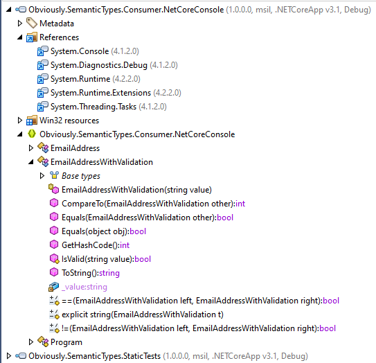

# Code Generation

## Input

File name: EmailAddressWithValidation.cs

```CSharp
using System;
using Obviously.SemanticTypes.Generator;

namespace Obviously.SemanticTypes.Consumer.NetCoreConsole
{
    [SemanticType(typeof(string))]
    public partial class EmailAddressWithValidation
    {
        public static bool IsValid(string value)
        {
            return value.Contains('@', StringComparison.OrdinalIgnoreCase);
        }
    }
}
```

## Output

### Code

File name: StringValidatingSemanticType.kY04X8b+.generated.cs

```CSharp
// ------------------------------------------------------------------------------
// <auto-generated>
//     This code was generated by a tool.
//
//     Changes to this file may cause incorrect behavior and will be lost if
//     the code is regenerated.
// </auto-generated>
// ------------------------------------------------------------------------------

using System;
using Obviously.SemanticTypes.Generator;

namespace Obviously.SemanticTypes.Consumer.NetCoreConsole
{
    public partial class EmailAddressWithValidation : global::System.IComparable<EmailAddressWithValidation>, global::System.IEquatable<EmailAddressWithValidation>
    {
        private readonly string _value;
        public EmailAddressWithValidation(string value)
        {
            if (!IsValid(value))
                throw new global::System.ArgumentException("The parameter is invalid", "value");
            _value = value;
        }

        public int CompareTo(EmailAddressWithValidation other)
        {
            return _value.CompareTo(other._value);
        }

        public bool Equals(EmailAddressWithValidation other)
        {
            if (other is null)
                return false;
            if (ReferenceEquals(this, other))
                return true;
            return _value == other._value;
        }

        public override bool Equals(object obj)
        {
            if (obj is null)
                return false;
            if (ReferenceEquals(this, obj))
                return true;
            return obj.GetType() == GetType() && Equals((EmailAddressWithValidation)obj);
        }

        public override int GetHashCode()
        {
            return _value.GetHashCode();
        }

        public static bool operator ==(EmailAddressWithValidation left, EmailAddressWithValidation right)
        {
            return Equals(left, right);
        }

        public static bool operator !=(EmailAddressWithValidation left, EmailAddressWithValidation right)
        {
            return !Equals(left, right);
        }

        public static explicit operator string(EmailAddressWithValidation t)
        {
            return t._value;
        }

        public override string ToString()
        {
            return _value.ToString();
        }
    }
}
```

### Compiled Assembly


